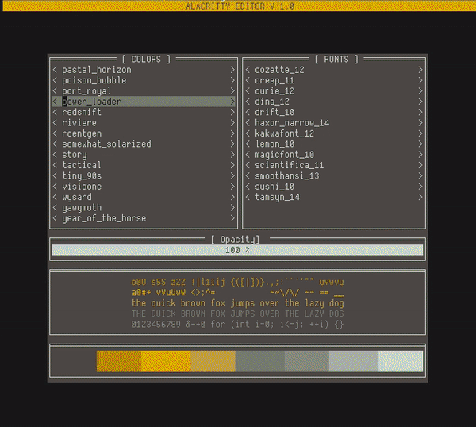

# AED
---
AED (Alacritty Editor) is a simple urwid-based TUI
for instantaneous color/font/opacity adjustments directly
in your shell for the alacritty terminal emulator.

<p align="center">

</p>

## Usage
```
usage: aed [-h] [--colors COLORS] [--font FONT] [--opacity OPACITY]

CLI and TUI tool for quickly editing Alacritty color/font/opacity options. The TUI will be launced if no options are specified.

options:
  -h, --help         show this help message and exit
  --colors COLORS    path to valid YAML file defining desired Alacritty color options
  --font FONT        path to valid YAML file defining desired Alacritty font options
  --opacity OPACITY  number from 0.0 to 1.0 inclusive to define a new window opacity. All valid input is rounded to the nearest hundredth.
```

To use the TUI, the alacritty configuration should be in
`$HOME/.config/alacritty/alacritty.yml`, and color and font files (with `*.yml`
extension) should be placed in `$HOME/.config/alacritty/colors` and
`$HOME/.config/alacritty/fonts` respectively. Use the arrow and enter keys to 
navigate the TUI. Plus and minus keys raise or lower the opacity by 0.1 respectively.

## Example Color File
```
colors:
  # Default colors
  primary:
    background: '0x000000'
    foreground: '0xc3dbcb'

  # Normal colors
  normal:
    black:   '0x28130e'
    red:     '0xb75e1c'
    green:   '0x825208'
    yellow:  '0x9c9273'
    blue:    '0x63452f'
    magenta: '0x807160'
    cyan:    '0xd8bd35'
    white:   '0xc3dbcb'

  # Bright colors
  bright:
    black:   '0x28130e'
    red:     '0xb85f1c'
    green:   '0x825208'
    yellow:  '0x9c9273'
    blue:    '0x63452f'
    magenta: '0x807160'
    cyan:    '0xd8bd35'
    white:   '0xc3dbcb'
```

## Example Font File
```
font:
  normal:
    family: Dina
    style: Medium
  bold:
    family: Dina
    style: Bold
  italic:
    family: Dina
    style: MediumItalic
  bold_italic:
    family: Dina
    style: BoldItalic
  size: 12.0
  offset:
    x: 1
    y: 0
  glyph_offset:
    x: 0
    y: 0
  use_thin_strokes: true
  builtin_box_drawing: true
```

## Requirements
1. Python 3+
2. Urwid 
3. ruamel.yaml
